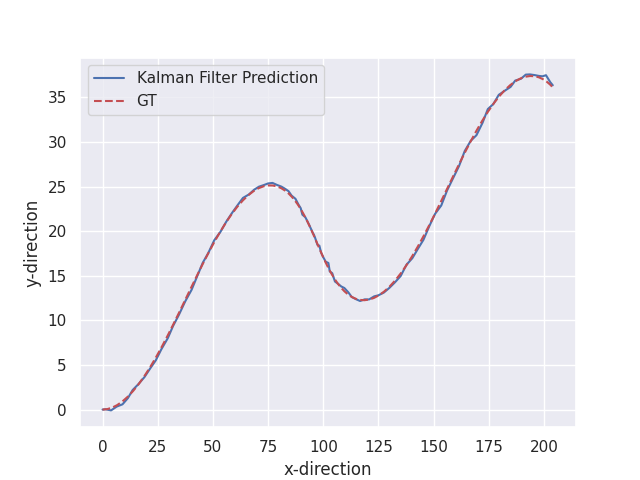

# TechnicalChallangemotorAI

## About The Project

The given repository contains solution for the **LiDAR - RADAR Fusion** problem. [Late-fusion-challenge.pdf](Late-fusion-challenge.pdf) contains further information of the task and the data used. The report containing the mathematical reasoning is given [here](report.pdf)

## Built With
This project was built with:

* python v3.8.12
* gcc 4.9

## Getting Started

Clone the repository into a local machine and enter the TechnicalChallange-motorAI directory using:

```shell
git clone https://github.com/vardeep-sandhu/TechnicalChallangemotorAI.git
cd TechnicalChallangemotorAI/
```
## Prerequisites

Since we are using external library Eigen for our C++ implementation, so for smooth running at different machines we will build a docker container. You can install docker on your local machine using this [link](https://docs.docker.com/engine/install/ubuntu/) and make sure you follow these [steps](https://docs.docker.com/engine/install/linux-postinstall/) to run Docker with root privilidges.

Additionally, you need to set $DATA variable in your bashrc to where the data is placed in your local machine. This can be done by:

```shell
export $DATA=/path/to/dataset
```


That's all you need!

## Instructions to run

To build the docker container run:

```
make start
```

This command will build the docker container.

You can test if all the appropriate packages of C++ and Python are installed by running:

```
make test
```

Now to run the docker container use the command:

```
make run
```

If everything goes accordingly then you will be taken to the Docker container. There are additionally some more packages that need to be installed. This is done by running:

```
bash run.sh
```

After this everything is set and we are ready to run the actual program. Here simply run the command:


```
python3 main.py -b [python, cpp]
```
Here `-b` flag signifies the backend that can be choosen for the task. There are two options `python` which invokes the kalmanfilter.py script or `cpp` which invokes the library in the `build/` directory. Thus, the results are generated and the output trajectory is saved in the local directory. Here is the sample of the generated trajectory.


## Results 

One of the main drawback of Kalman Filter algorithm is it's sensitivity to initialization. Kalman Filters are quite sensitive to the initial values of their internal variables, such as the covariance matrix. If these initial values are not set correctly, the Kalman Filter may produce poor estimates. 

After experimenting with different values of process and measurement noise we settled with the values that we used in the implementation. This lead to an Average Displacement Error of **0.2294** when we quantitatively compared the perdicted and the GT trajectory. 

Qualitatively, we show in the figure below the comparison of the perdicted trajectory and the GT trajectory (dotted red). 

